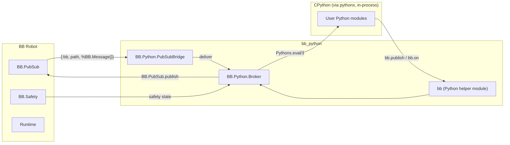

<!--
SPDX-FileCopyrightText: 2026 James Harton

SPDX-License-Identifier: Apache-2.0
-->

# Proposal: bb_python

**Status:** Draft
**Author:** James Harton
**Created:** 2026-05-22
**Dependencies:** `bb`, `{:pythonx, "~> 0.4"}`

---

## Summary

`bb_python` gives Beam Bots robots a curated, safety-aware Python integration on top of [`pythonx`](https://hex.pm/packages/pythonx) — Livebook's in-process CPython embedding. The goal is to let robotics teams call into the Python ecosystem (perception, ML inference, motion planners, OEM SDKs) from a BB robot **without** owning the GIL story themselves, and to do it through a small set of opinionated primitives that respect BB's command, PubSub, and safety semantics.

---

## Motivation

### The "Python is where the libraries live" problem

A great deal of practical robotics tooling — vision (OpenCV, MediaPipe, YOLO), inverse-kinematics solvers (PyBullet, Drake bindings), motion planning (MoveIt 2 Python API), perception models (PyTorch, ONNX Runtime), manufacturer SDKs (Intel RealSense, Robotiq) — exists in Python first, with Elixir bindings either absent or stale.

Three things follow:

1. Teams either rewrite work in Elixir (slow, error-prone, drifts from upstream) or push the workload out of the BEAM (gRPC, ZeroMQ, ROS bridges — operational overhead).
2. Newer high-value capabilities (LLM-driven planning, learned policies, depth perception) ship in Python months or years before a native Elixir option exists.
3. Inside a single BEAM node, the cost of *not* having Python access is high; the cost of *having* it via `pythonx` is low: one shared interpreter, one set of dependencies, predictable lifecycle.

### Why `pythonx` specifically?

[`pythonx`](https://hex.pm/packages/pythonx) (v0.4.10, by Livebook, Apache-2.0) embeds CPython directly into the BEAM as a NIF. The package's properties matter:

| Property | Implication |
|---|---|
| In-process, one interpreter per node | Calls are cheap (no IPC), but the GIL is real |
| `uv`-managed Python environment from a `pyproject.toml` | Deterministic, release-friendly, reproducible across nodes |
| `Pythonx.eval/3` returns `{result, globals}` | Stateful globals are explicit; we can choose where state lives |
| `Pythonx.Encoder` protocol | Custom Elixir types marshal cleanly |
| `Pythonx.Object` opaque handle | Large NumPy / torch values stay on the Python side without copying |
| FLAME-aware | Compatible with our existing distribution story |

The two things to design around are equally clear:

1. **Single GIL.** All Python work serialises through the interpreter. Concurrent BEAM processes calling `Pythonx.eval/3` block one another. Native libs (NumPy, PyTorch) release the GIL during heavy work; pure-Python does not.
2. **One process, one Python.** A Python segfault is a BEAM segfault. We need a clear boundary between "Python is a helper" and "Python drives the realtime loop" (it should never do the latter).

`bb_python` puts both constraints front-and-centre rather than hiding them.

### Why a separate package?

- `bb` stays NIF-free for embedded targets that cannot afford CPython (small Nerves devices, custom MCU bridges).
- Releases ship Python deps via the `uv_init` compile-time path, but only when the dependency exists.
- The package mirrors `bb_jido` / `bb_mcp` / the proposed `bb_lua`: BB is the substrate, adapters are layered consumers.

### Where this sits

```
┌──────────────────────────────────────────────────────────┐
│ Python module                                            │
│   def grasp_pose(rgbd): … return pose                    │
├──────────────────────────────────────────────────────────┤
│ bb_python                                                │
│   - Serialising GenServer in front of Pythonx            │
│   - Command/Reactor step wrappers                        │
│   - PubSub bridge for Python ←→ BEAM message flow        │
│   - Safety-aware dispatch + GIL-aware scheduling         │
├──────────────────────────────────────────────────────────┤
│ BB                                                       │
│   commands · pubsub · safety · runtime · math            │
└──────────────────────────────────────────────────────────┘
```

`bb_python` is not a replacement for Elixir control code. It is a structured way to **call into Python from BB code**, with realtime work staying in Elixir/Nx.

---

## Design

### Lifecycle: a single broker GenServer

Because `pythonx` provides exactly one interpreter and one GIL per node, `bb_python` exposes Python through a single `BB.Python.Broker` GenServer. All `eval` traffic flows through it. This is the pattern `pythonx`'s own docs recommend.

```elixir
defmodule BB.Python.Broker do
  use GenServer

  # public API
  def call(robot, fun, args, opts \\ []), do: …
  def eval(robot, code, globals, opts \\ []), do: …
  def import(robot, module), do: …
end
```

Key behaviours:

- **One broker per robot module**, supervised by the host application. The robot identity propagates as `bb_robot` in every Python globals map, the same way `bb_reactor` propagates `context.private[:bb_robot]`.
- **All blocking work happens inside the broker.** Callers `GenServer.call/2` and block; the broker holds the GIL for the duration of one Python operation. This is the simplest correct model.
- **Timeouts mandatory.** Every public call accepts a `:timeout` and defaults to `30_000`. A timed-out call is the canonical recovery boundary for misbehaving Python code.
- **No automatic retries.** Python operations are not assumed idempotent.
- **Logs and tracebacks** from `Pythonx.Error` are surfaced verbatim into the caller's error term and into telemetry.

### Configuration: `pyproject.toml` lives in the robot module

The robot opts into a Python environment declaratively. Mirroring `bb_lua`'s `lua do … end`, we add a `python do … end` block:

```elixir
defmodule WX200 do
  use BB.Robot, extensions: [BB.Python.Robot]

  python do
    pyproject """
    [project]
    name = "wx200_python"
    version = "0.0.0"
    requires-python = "==3.13.*"
    dependencies = [
      "numpy==2.2.2",
      "opencv-python-headless==4.10.*",
      "torch==2.4.*",
    ]
    """

    expose_commands [:grasp_from_rgbd]
    expose_topics   [[:sensor, :camera, :rgbd]]
  end
end
```

At compile time (release path) `Pythonx.uv_init/2` resolves the environment into the package's `priv` dir; at dev time the same call runs on broker startup if the env is missing. The host application can override either with standard `config :bb_python, ...` overrides — e.g. for cross-compilation to Nerves the resolution should happen on the build host, not the device.

### Calling convention

Python functions live in modules the broker `import`s on demand:

```elixir
{:ok, %BB.Math.Transform{} = pose} =
  BB.Python.call(WX200, {"my_robot.perception", "grasp_pose"},
    [rgbd: rgbd_payload],
    return: BB.Math.Transform,
    timeout: 5_000
  )
```

The `:return` option drives decoding:

- `:auto` (default) — `Pythonx.decode/1`, falling back to `%Pythonx.Object{}`.
- A BB math type (`BB.Math.Vec3`, `.Quaternion`, `.Transform`) — converts from a known Python representation (list / 4×4 nested list / NumPy array of compatible shape).
- A custom decoder function `(Pythonx.Object.t() -> term())` for project-specific types.

Errors return `{:error, term()}`:

| `{:error, ...}` | Meaning |
|---|---|
| `{:python_error, traceback_string}` | Python exception (from `Pythonx.Error`) |
| `{:timeout, ms}` | Broker call exceeded `:timeout` |
| `{:unknown_module, name}` | Import failed |
| `:safety_not_armed` | Safety state was not `:armed` and `:safety` was `:require_armed` |
| `:safety_disarmed` | Safety tripped while the call was in flight |

These align with `BB.Command.await/2`, `BB.Jido.Action.Command`, and the `bb_lua` taxonomy.

### Marshalling

Default mappings (built on `Pythonx.Encoder` + `Pythonx.decode/1`):

| BB / Elixir | Python |
|---|---|
| `nil` / `true` / `false` | `None` / `True` / `False` |
| integer / float | `int` / `float` |
| binary (UTF-8) | `str` (default) or `bytes` (when declared) |
| atom | `str` (always) — host disallows atoms as decoded outputs unless the call site whitelists them |
| list / tuple | `list` / `tuple` |
| keyword list / map | `dict` |
| `%BB.Math.Vec3{}` | NumPy `ndarray` of shape `(3,)` (or `list` if NumPy unavailable) |
| `%BB.Math.Quaternion{}` | `ndarray` of shape `(4,)` in WXYZ order |
| `%BB.Math.Transform{}` | `ndarray` of shape `(4, 4)` row-major |
| `%Localize.Unit{}` | `dict {"value": …, "unit": "meter"}` |
| `%BB.Message{}` (in PubSub callbacks) | `dict` with `payload`, `frame_id`, `monotonic_time`, `wall_time`, `node` |
| Anything else | `%Pythonx.Object{}` opaque handle |

Large tensors (camera frames, voxel grids) are kept as `%Pythonx.Object{}` and threaded through subsequent calls without copying back into Elixir. The boundary rule: **decode to Elixir only at the seams** (control decisions, command goals). Pure Python pipelines stay in Python.

A `BB.Python.Encoder` protocol mirrors `Pythonx.Encoder` for project-specific structs.

### PubSub bridge

Python ↔ BB events follow the same `BB.Python.PubSubBridge` pattern as `bb_jido` and `bb_lua`:

```elixir
defmodule BB.Python.PubSubBridge do
  use GenServer
  # subscribes to configured BB.PubSub topics on behalf of the broker.
  # On each {:bb, path, %BB.Message{}}, it enqueues a delivery into the broker
  # mailbox, which calls into a registered Python handler:
  #
  #     handlers = { "sensor.camera.rgbd": some_python_callable, ... }
end
```

From Python, handlers register through a small `bb` module the broker injects into the Python environment at startup:

```python
import bb

@bb.on("sensor.camera.rgbd")
def handle_rgbd(msg):
    # msg["payload"] is a dict; msg["frame_id"], msg["monotonic_time"] available
    process(msg["payload"]["image"])
```

Important constraints:

- Handlers run **inside the broker process**, holding the GIL. Long-running handlers block all other Python traffic.
- The same throttling / sampling controls as `BB.Jido.PubSubBridge` apply (`throttle_ms: %{"sensor.joint_state" => 50}`).
- Handlers cannot publish to BB.PubSub directly — they call `bb.publish(path, payload)` which crosses back into the broker, which calls `BB.PubSub.publish/3`. This keeps message construction Elixir-side and validated.

### Safety integration

Two layers:

1. **Pre-dispatch:** every `BB.Python.call/4` (when `:safety` is `:require_armed`, the default) reads `BB.Safety.state(robot)` from ETS before crossing into Python. Disarmed → `{:error, :safety_not_armed}`.
2. **Mid-flight:** the broker subscribes to `[:state_machine]` and `[:safety]`. If safety trips during an in-flight call, the broker raises a `KeyboardInterrupt` into the Python thread (CPython supports this from another OS thread via `PyThreadState_SetAsyncExc`, exposed through Pythonx). The pending call returns `{:error, :safety_disarmed}`.

Python code **cannot** arm or disarm the robot, just as Lua cannot. The `bb` module exposes only read-only `bb.safety_state()` and `bb.armed()`.

### Command wrappers (and a reactor step)

For symmetry with `bb_jido` and `bb_reactor`, two thin wrappers ship in v0.1:

```elixir
defmodule BB.Python.Action.Call do
  # Plain wrapper: invoke a Python function as a single BB-side action.
  # Used by bb_jido and bb_reactor without taking a hard dependency.
end

defmodule BB.Reactor.Step.PythonCall do
  # Optional, behind `if Code.ensure_loaded?(BB.Reactor)`:
  # a Reactor step that runs a Python call as part of a workflow, with
  # standard error / compensation handling.
end
```

These exist so a typical workflow ("perceive with Python, plan with Reactor, act with BB commands") composes cleanly without forcing every consumer to handle GIL/timeouts themselves.

### Process model summary



There is one broker, one bridge, and one Python interpreter per node.

---

## Package Structure

```
bb_python/
├── lib/
│   └── bb/
│       └── python/
│           ├── action/
│           │   └── call.ex          # Action wrapper for bb_jido / bb_reactor
│           ├── broker.ex            # Serialising GenServer in front of Pythonx
│           ├── docs.ex              # Markdown generator for exposed surface
│           ├── encoder.ex           # Protocol + default impls
│           ├── error.ex             # Closed-set error mapping
│           ├── pubsub_bridge.ex     # PubSub → Python handler bridge
│           ├── robot.ex             # Spark extension on BB.Robot (python do … end)
│           ├── safety.ex            # Safety gating + async-exception interrupt
│           └── env.ex               # uv_init management & install paths
├── priv/python/
│   └── bb/                          # The injected `bb` Python module
│       ├── __init__.py
│       ├── safety.py
│       └── pubsub.py
├── test/
├── mix.exs
├── README.md
└── CHANGELOG.md
```

### Dependencies

```elixir
defp deps do
  [
    {:bb, bb_dep("~> 0.13")},
    {:pythonx, "~> 0.4"},
    {:spark, "~> 2.2"},
    # Optional, soft dependencies — only used when present:
    {:bb_reactor, bb_dep("~> 0.x"), optional: true}
  ]
end
```

The compile-time `uv_init` config lives in `config/config.exs` and is wired up by the host application; `bb_python` provides defaults but does not mandate them.

---

## User Experience

### One-shot Python call

```elixir
{:ok, %BB.Math.Transform{} = pose} =
  BB.Python.call(WX200,
    {"perception.grasping", "best_grasp"},
    [rgbd: rgbd, target: "red_cube"],
    return: BB.Math.Transform
  )

{:ok, _} = WX200.move_to_pose(%{target: pose})
```

### Streaming events into Python

```elixir
# In the host application supervisor:
children = [
  WX200,
  {BB.Python.Broker, robot: WX200},
  {BB.Python.PubSubBridge, broker: WX200,
   topics: [[:sensor, :camera, :rgbd]]}
]
```

```python
# anywhere in your Python module
import bb
import numpy as np

@bb.on("sensor.camera.rgbd")
def on_rgbd(msg):
    frame = msg["payload"]["image"]   # arrives as numpy via the encoder
    bb.publish(["perception", "objects"], {"detections": detect(frame)})
```

### Compose with bb_jido

```elixir
defmodule MyRobot.Perceive do
  use Jido.Action,
    name: "perceive",
    schema: [target: [type: :string, required: true]]

  def run(%{target: target}, %{agent: agent}) do
    BB.Python.Action.Call.run(%{
      robot: agent.state.robot.robot,
      function: {"perception.grasping", "best_grasp"},
      args: [target: target],
      return: BB.Math.Transform
    })
  end
end
```

### Supervised in an application

```elixir
defmodule MyApp.Application do
  use Application

  def start(_type, _args) do
    children = [
      WX200,
      {BB.Python.Broker, robot: WX200},
      {BB.Python.PubSubBridge, broker: WX200, topics: [[:sensor, :camera, :rgbd]]}
    ]

    Supervisor.start_link(children, strategy: :one_for_one)
  end
end
```

---

## Acceptance Criteria

### Must Have

- [ ] `BB.Python.Broker` GenServer with serialised `call/4`, `eval/4`, `import/2`, `:timeout` on every call
- [ ] `BB.Python.Robot` Spark extension with `python do … end` block (`pyproject`, `expose_commands`, `expose_topics`, `expose_parameters`)
- [ ] Environment bootstrap via `Pythonx.uv_init/2`, both at compile time and broker startup
- [ ] Value marshalling for primitives + `Vec3` / `Quaternion` / `Transform` / `Localize.Unit` / `BB.Message`
- [ ] Safety gating using `BB.Safety.state/1` before every call (`:require_armed` default)
- [ ] Mid-flight safety interrupt via `PyThreadState_SetAsyncExc` translating to `{:error, :safety_disarmed}`
- [ ] `BB.Python.PubSubBridge` with topic allow-listing and per-topic throttling
- [ ] Injected `bb` Python module providing `bb.on(...)`, `bb.publish(...)`, `bb.safety_state()`, `bb.armed()`
- [ ] Closed-set error taxonomy aligned with `BB.Command.await/2`
- [ ] Tests covering dispatch, safety gating, error mapping, marshalling, and event delivery
- [ ] README + at least one runnable example (e.g. `examples/perception/`)

### Should Have

- [ ] `BB.Python.Action.Call` for `bb_jido` agents
- [ ] `BB.Reactor.Step.PythonCall` (gated on `Code.ensure_loaded?/1`)
- [ ] `BB.Python.Docs.generate/1` producing markdown for exposed callables
- [ ] `BB.Python.Encoder` protocol for custom Elixir types
- [ ] Telemetry events on broker call start/stop, eval start/stop, GIL hold time
- [ ] Example: NumPy/Nx round-trip using `Pythonx.Object` (no Elixir-side copy)
- [ ] Nerves cross-compilation notes (install-paths recipe)

### Won't Have

- [ ] In-Python arming / disarming / force-disarming
- [ ] Multiple Python interpreters per node (pythonx limitation)
- [ ] Python in the realtime control loop (use Elixir/Nx)
- [ ] Async / concurrent Python execution (single broker serialises)
- [ ] `Pythonx.Object` direct construction from Lua / Reactor / agents — only through the broker
- [ ] Hot-reload of Python source modules at runtime (restart the broker)

---

## Open Questions

1. **Concurrent calls.** A single serialising broker is the safe default, but is there value in a *small* pool of brokers driving sub-interpreters once pythonx supports them? v0.1: single broker. Track upstream.
2. **Nerves and cross-compilation.** `uv_init` downloading CPython on a Pi is bandwidth-hostile. The likely answer is "build the env on the host, package it as part of the firmware via `install_paths/0`" — needs concrete recipe.
3. **Process supervision of Python work.** A Python segfault crashes the BEAM. Do we expose an opt-in *out-of-process* broker (Port-based) for high-risk libraries, mirroring the in-process API? v0.1: no, but design the broker API so it could.
4. **`bb.on` handler concurrency.** Handlers run sequentially under the GIL. Should we provide a "fire and forget" `bb.spawn` that queues work on a Python `ThreadPoolExecutor` (which releases the GIL when waiting)? Plausible v0.2.
5. **Decoding policy for atoms.** Decoding `str` → `atom` would be convenient but unsafe (atom table). Stay on `str` everywhere; require callers to opt in per-call via `:atom_keys` / `:atom_values`?
6. **Reactor compensation.** When a Python step fails inside a reactor saga, what is compensable? Same answer as `bb_jido`: the reactor's own compensation semantics are the source of truth; the Python wrapper just surfaces a clean error.
7. **Telemetry granularity.** GIL hold time is high-value; how often do we sample? Probably once per call (entry / exit / wall-clock), with a separate "long call" warning above a configurable threshold.

---

## References

- [`pythonx` on Hex](https://hex.pm/packages/pythonx) — Embedded CPython for the BEAM
- [`pythonx` repo](https://github.com/livebook-dev/pythonx) — Source, `uv` integration, `Pythonx.Encoder` protocol
- [Livebook Python cells](https://news.livebook.dev/) — Reference consumer of pythonx
- [CPython embedding docs](https://docs.python.org/3/c-api/init.html) — GIL semantics and `PyThreadState_SetAsyncExc`
- [`uv`](https://docs.astral.sh/uv/) — Python package/environment manager used by `pythonx`
- [Beam Bots `bb_jido` proposal](./0009-bb-jido.md) — Source of the PubSubBridge, SafetyAware, and error-taxonomy patterns
- [Beam Bots `bb_lua` proposal](./0015-bb-lua.md) — Sibling external-language binding; shared marshalling / safety conventions
- `bb/lib/bb/command.ex`, `bb/lib/bb/safety.ex`, `bb/lib/bb/pub_sub.ex` — Primary BB surfaces this proposal projects
